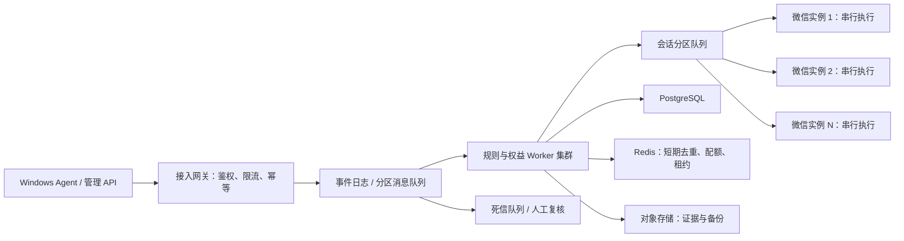

# 高突发处理方案

> 适用范围：当前不含游戏包的联系人/群备注、群 `@机器人`、服务激活和后台管理。本文描述生产目标架构，不表示当前 SQLite 开发切片已实现全部组件。

## 1. 核心结论

高突发要拆成两个不同问题：

1. API、规则、权益和消息处理层可以通过分区队列、缓存和无状态服务横向扩容。
2. 单个微信实例的 UI 操作不能并发，必须维持一条有界串行队列；总体吞吐靠增加经过授权的微信账号和独立 Windows 会话扩展。

任何方案都不应通过多个线程同时点击同一个微信窗口来换取吞吐，这会造成焦点串话、错群发送和不可恢复的重复操作。

## 2. 目标架构



建议生产组件：PostgreSQL 16+、Redis 7+、RabbitMQ quorum queue 或 Kafka、S3 兼容对象存储、OpenTelemetry。规模不大时优先 RabbitMQ；需要长时间回放、多消费者和高事件吞吐时选择 Kafka。

## 3. 分区与顺序

- 入站事件以 `tenantId + weChatAccountId + conversationId` 作为分区键，同一会话严格有序，不同会话并行处理。
- UI 动作以 `weChatInstanceId` 作为最终分区键，每个实例同时只允许一个动作。
- 激活码兑换、备注任务、消息事件和外发动作都必须携带全局幂等键；消费者按“至少一次投递 + 幂等落库”设计。
- 规则处理与 UI 执行分离。高峰时规则层可以快速完成判定，UI 层按照优先级和配额排队。
- `@机器人`、人工接管和安全停用为高优先级；备注同步和低优先级通知可以延迟、合并或丢弃过期任务。

## 4. 削峰与背压

- 网关按租户、API Key、目标账号和操作类型做令牌桶限流，返回 `429` 和明确的重试时间。
- 队列设置最大长度、消息 TTL 和死信队列。过期的回复任务不得在高峰结束后继续发送。
- 每个微信实例配置有界队列。达到高水位后停止接收低优先级任务，并向管理台报告“降级中”。
- 联系人/群备注在入队前按目标合并，只保留最新期望值，避免同一目标积累多次过时修改。
- 相同群消息在短时间窗口内用事件 ID 和内容指纹去重；持久层唯一索引承担最终防重。
- 外部依赖使用超时、熔断、隔离舱和带抖动的指数退避；不可盲目重试状态不确定的 UI 动作。

## 5. 扩容模型

先通过压测测得单个受控微信实例在目标客户端版本、DPI 和机器规格下的安全吞吐 `R`，再按峰值到达率 `P`、目标利用率 `U`（建议不高于 0.6）计算实例数：

```text
实例数 N >= ceil(P / (R * U))
```

还应预留至少一个故障域的容量。实例不能共享交互式桌面；每个实例使用独立 Windows 会话或独立主机，并绑定唯一租约，防止重复消费。

容量评审必须同时记录：峰值每秒事件数、峰值持续时间、各优先级比例、可接受排队时间、单实例实测发送耗时、微信频控结果和人工接管比例。未拿到这些数据前不能承诺具体 QPS。

## 6. 数据层

- 当前 SQLite 仅用于单机开发。生产切换 PostgreSQL，写入按租户和时间建立索引，大表按月或按租户分区。
- 激活兑换在单个数据库事务内完成，使用唯一约束和行锁保证 100 次并发兑换只产生一份权益。
- 审计与权益流水采用追加写；消息正文、截图和附件分离存储，数据库只保存索引、哈希和保留策略。
- Redis 只用于可重建的短期状态，不能作为权益、兑换和审计事实的唯一存储。
- 备份采用数据库连续归档/PITR 加对象存储版本控制；应用逻辑备份用于租户级导出和演练，不替代数据库灾备。

## 7. 降级策略

从轻到重依次执行：

1. 延迟自动备注和统计任务。
2. 关闭非必要的自动回复，只保留 `@机器人`、激活提示和转人工。
3. 对同一群的重复查询返回一次处理中状态，合并后续请求。
4. 暂停领取新任务，保留已开始动作的状态确认。
5. 触发全局急停，所有状态不确定动作进入人工复核，禁止自动重放。

## 8. 压测与验收

- API 层分别执行稳定负载、10 倍突发和 30 分钟积压恢复测试。
- 验证同一激活码 100 次并发兑换只生成一份权益和一条成功流水。
- 验证同一事件重复投递、消费者重启和网络超时不会产生重复回复。
- 验证队列超过高水位后低优先级任务被背压，高优先级 `@` 仍满足目标延迟。
- UI 层使用专用测试账号和测试群做长稳测试；验收指标必须包含零错目标、零盲目重发和状态不确定时闭锁。
- 演练单个 Agent、队列节点、Redis、数据库主节点和对象存储故障，并记录恢复时间与数据缺口。

## 9. 当前实现与生产差距

当前仓库已具备 API 幂等、激活并发保护、UI 串行执行框架和本地持久化，但尚未接入生产消息队列、Redis、PostgreSQL、高可用部署和完整压力测试。微信 `4.1.11.55` 还需要混合识别适配并通过安全验收，因此现阶段只能验证业务控制面，不能据此承诺真实微信吞吐。
